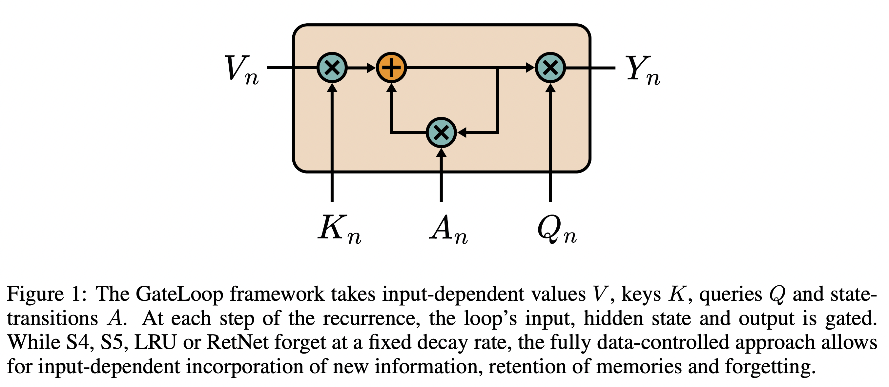

# GateLoop


<br />

Implementation of [arxiv.org/abs/2311.01927](https://arxiv.org/abs/2311.01927) in JAX based on [lucidrains/gateloop-transformer](https://github.com/lucidrains/gateloop-transformer).

### Installation
`pip install gateloop`

### Usage
```py
from gateloop import GateLoopTransformer

key = jax.random.PRNGKey(0)
model = GateLoopTransformer(
    num_tokens = 1000, 
    dim = 512, 
    depth = 12
)
params = model.init(key, jnp.ones((1, 10), jnp.int32))
ids = jax.random.randint(key, (1, 10), 0, 1000)
logits = model.apply(params, ids)
```

### Citations

```bibtex
@inproceedings{Katsch2023GateLoopFD,
    title   = {GateLoop: Fully Data-Controlled Linear Recurrence for Sequence Modeling},
    author  = {Tobias Katsch},
    year    = {2023},
    url     = {https://api.semanticscholar.org/CorpusID:265018962}
}
```